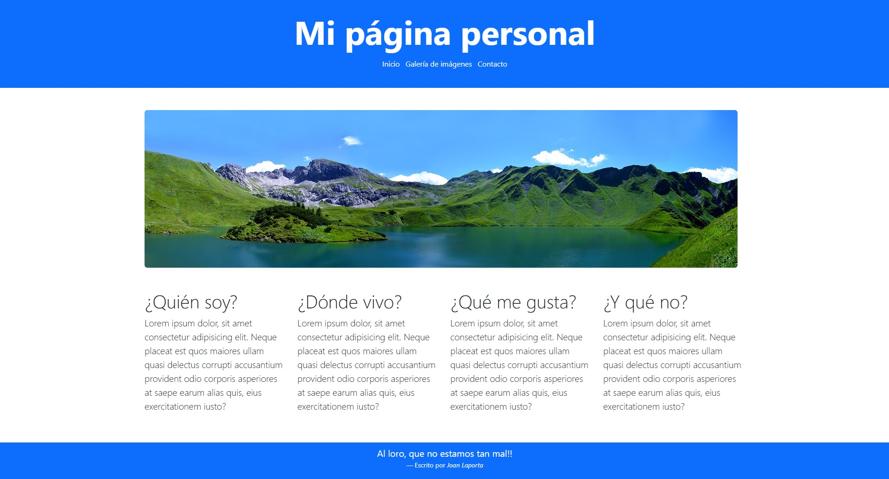
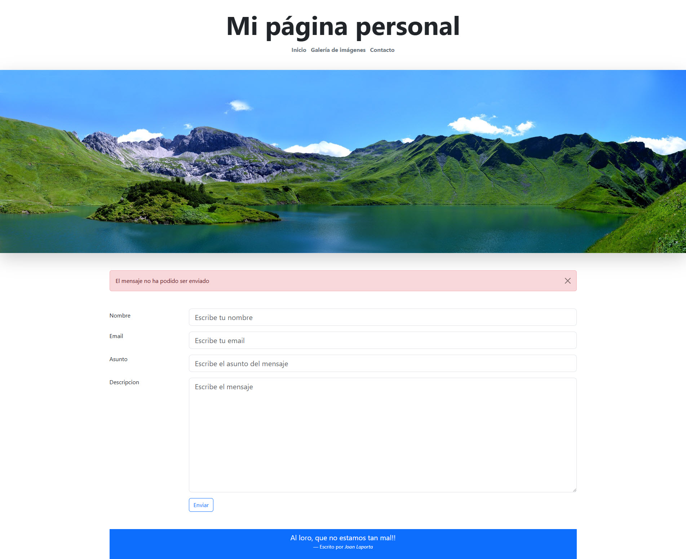
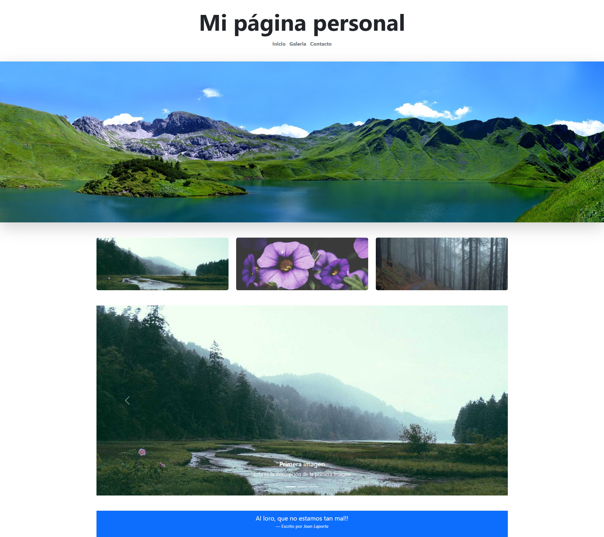
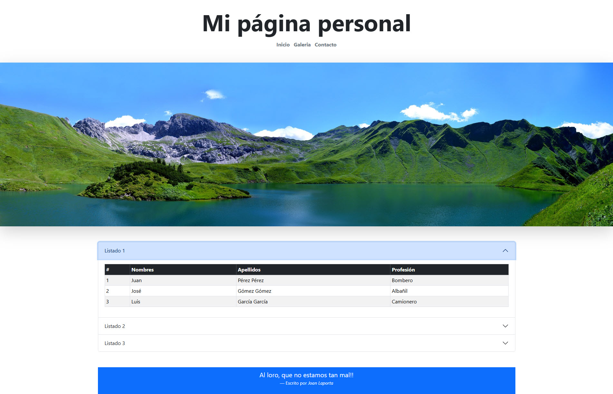
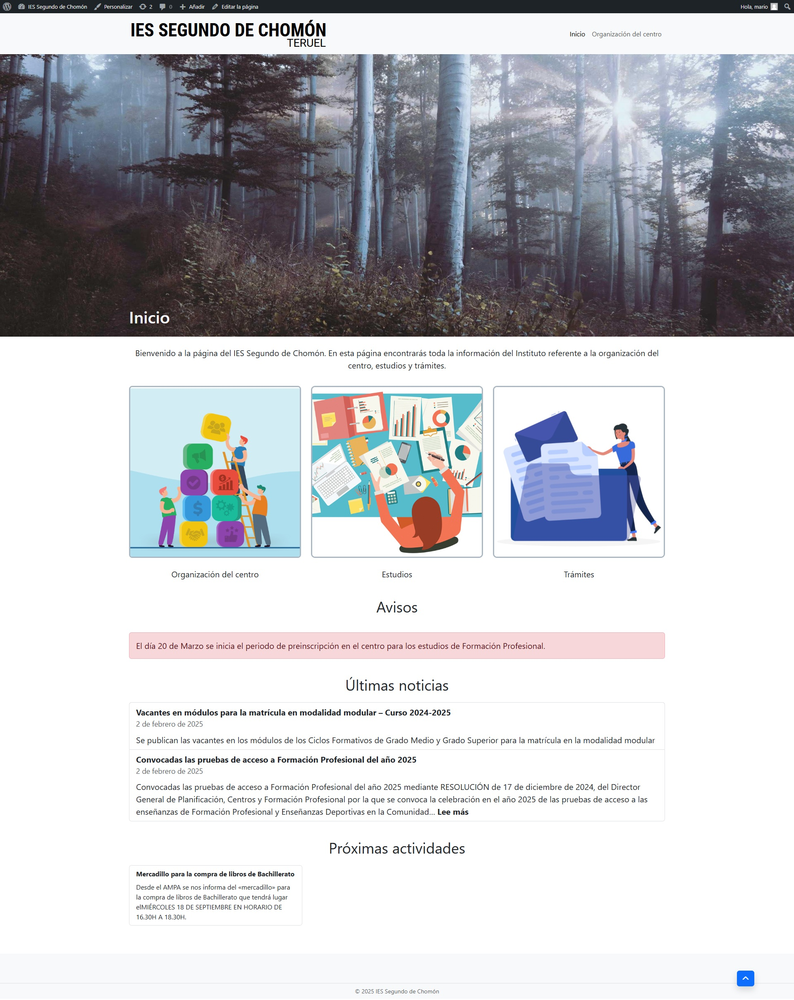

# Aplicaciones Web
Asignatura Aplicaciones Web de 2º curso del ciclo de grado medio Sistemas Microinformáticos y Redes

## Bootstrap

### Prácticas

- [X] Práctica 1: Introducción a Bootstrap. Clase Container
- [X] Práctica 2: Grids
- [X] Práctica 3: Introducción al formateo de textos
- [X] Práctica 4: Listas
- [X] Práctica 5: Imágenes
- [X] Práctica 6: Tablas
- [X] Práctica 7: Formularios
- [ ] Práctica 8: Listas desplegables
- [ ] Práctica 9: Input group
- [X] Práctica 10: Alertas
- [X] Práctica 11: Botones
- [X] Práctica 12: Cards
- [ ] Práctica 13: Listado de grupos
- [X] Práctica 14: Carrusel
- [X] Práctica 15: Collapse
- [ ] Práctica 16: Menús
- [X] Práctica 17: Acordeones

### Apuntes

- [Márgenes y espaciado](MARGENES.md)
- [Tamaño del texto](TEXTO.md)
- [Color del texto](TEXTO2.md)
- [Color del fondo](COLOR_DE_FONDO.md)

### Enlaces

- https://picsum.photos/
- [Tips de diseño](https://www.youtube.com/watch?v=n189TdfbQIA)

### Entregas

Al final de este bloque deberemos entregar una página web personal con 4 páginas:

- [X] Página principal
  - Esta página utilizará un grid para crear su estructura básica: una cabecera, un cuerpo y un pie.
  - En la cabecera incluiremos el título de la página, una imagen y un menú de navegación. La imagen se debe adaptar al ancho de nuestra pantalla.
  - El cuerpo, a su vez, contendrá una sección lateral y una sección principal. La sección principal contendrá varias columnas que se ajustarán en función del tamaño de la pantalla.	  
  - En el pie de página incluiremos dos columnas. En la primera, pondremos nuestros datos de contacto (nombre y correo electrónico). En la segunda, adjuntaremos una cita. La disposición de ambas se ajustará al ancho de la pantalla.
  - Fecha de entrega **19/1/2025**
  
  
  
- [X] Formulario de contacto
  - Esta página mostrará un formulario que nos permitirá enviar un correo electrónico. Este formlularo tendrá campos para el nombre, el correo electrónico, el asunto y el cuerpo del mensaje.
  - Este formulario se mostrará en dos columnas para un tamaño de pantalla grande y en una para un tamaño de pantalla pequeño.
  - Este formulario incluirá un botón. Al clicar sobre él, se mostrará una alerta indicando que el mensaje no se ha podido enviar.
  - Esta alerta contendrá un botón que nos permitirá cerrarla.
  - Fecha de entrega **26/1/2025**
	
  
  
- [X] Galería de imágenes
  - Esta página mostrará una serie de imágenes (al menos 6) mediante un Carousel.
  - El Carousel incluirá botones para navegar por las imágenes y un texto descriptivo de cada una que aparecera encima.
  - Arriba del Carousel aparecerá una vista en miniatura de todas las imágenes, en columnas de 3 para pantallas grandes y en columnas de 1 para dispositivos pequeños.
  - Fecha de entrega **29/1/2025**
  
   
   
- [X] Página de listados
  - Está página mostrará un acordeón con 3 elementos.
  - Dentro de cada elemento del acordeón habrá una tabla.
  - Fecha de entrega **31/2/2025**
  
  
  
**ENTREGA FINAL 31/1/2025**

## Backend

- [X] Práctica 1: Envío de los datos de un formulario al servidor y ejecución de un programa php
  - Introducción a XAMPP
    - [Instalación de XAMPP en Linux](https://www.geeksforgeeks.org/how-to-install-xampp-in-linux/)
  - [Introducción a PHP](PHP.md)
    - [Manual de PHP](https://www.php.net/manual/es/)
  - [Intruducción a SQL](SQL.md)
  - Introducción a PhpMyAdmin
  - [Integración de PHP y MySql](PHP+SQL.md)

## Wordpress

### Prácticas

- [X] Práctica 1: [Instalación de Wordpress](WORDPRESS-INSTALACION.md) - 10/2/2025
- [X] Práctica 2: [Primeros pasos en Wordpress](WORDPRESS-PRIMEROSPASOS.md) - 12/2/2025
- [X] Práctica 3: [Páginas](WORDPRESS-PAGINAS.md) - 14/2/2025
- [X] Práctica 4: [Editor de bloques Gutemberg](WORDPRESS-GUTEMBERG.md) - 17/2/2025
- [ ] Práctica 5: [Ajustes](WORDPRESS-AJUSTES.md) - 19/2/2025
- [X] Práctica 6: [Entradas](WORDPRESS-ENTRADAS.md) - 19/2/2025
- [X] Práctica 7: [Plugins](WORDPRESS-PLUGINS.md) - 24/2/2025
- [X] Práctica 8: [Importar y exportar](WORDPRESS-IE.md) - 24/2/2025

### Enlaces

- https://bootscore.me/#download

### Entregas

Al final de este bloque, deberás entregar una página web hecha en Wordpress con la información del IES Segundo de Chomón. Esta Web contendrá las siguientes páginas:

- [ ] Página de inicio

  
  
- [ ] Página con la organización del centro
  - Esta página contendrá 4 tablas similares a las que puedes encontrar en https://www.iesch.org/index.php/instituto/organizacion
- [ ] Páginas de estudios
  - Estas páginan (5) contendrán la información de las asignaturas de los Ciclos Formativos de Grado Medio que ofrece el centro y que puedes encontrar en https://www.iesch.org/index.php/oferta-formativa/ciclos-formativos-de-grado-medio
- [ ] Trámites
  - Esta página contendrá algunos de los trámites disponibles en https://www.iesch.org/index.php/secretaria/tramites
    - Solicitud de títulos
    - Solicitud del certificado de Prevención de Riesgos Laborales
	
Además, deberás añadir al menos 3 noticias y 3 actividades como las que puedes encontrar en la página de inicio del instituto.

## Exámenes

- [X] Examen Bootstrap: **7/2/2025**
- [ ] Examen MySql/Php/PhpMyAdmin + Wordpress **28/2/2025**